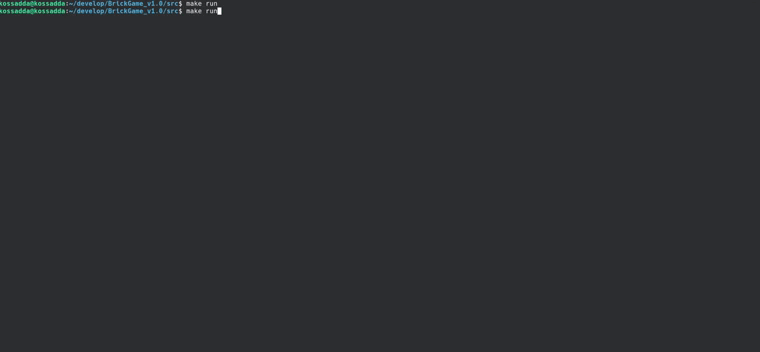
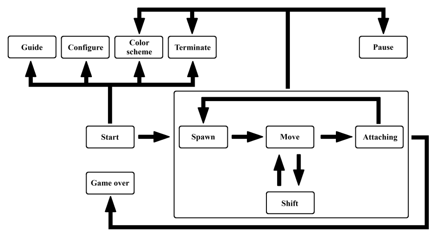
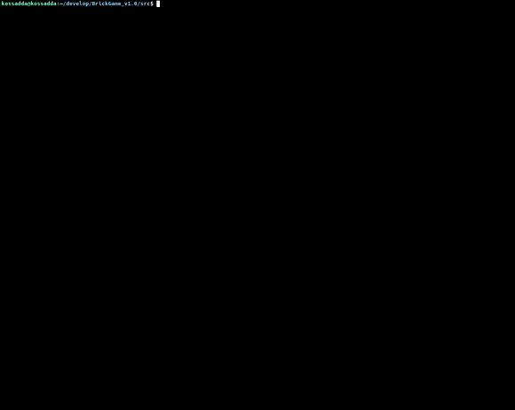

# Brickgame v1.0

Implementation BrickGame v1.0.

The Russian version of the README can be found in the repository.

## Contents
1. [Appearance](#appearance)
2. [Project description](#project-description)
3. [Building project](#building-project)
4. [Testing](#testing)
5. [Feedback](#feedback)

 

## [Appearance](#brickgame-v10)

## [Project description](#brickgame-v10)

The goal of this project is to implement it in the C programming language using the structured approach of the Tetris game. The implementation of the game consists of two parts: a library that implements the logic of the game, which can be connected to various GUIs in the future, and a terminal interface. The logic of the library is implemented using a finite state machine.

The applied finite state machine has the following states:

| State name         | State description                                                                                    | State Availability |
| ------------------ | ---------------------------------------------------------------------------------------------------- | ------------------ |
| `Start`            | A state in which the game waits for the player to press the ready to play button                     | In the main menu   |
| `Guide`            | A state in which key assignments are displayed                                                       | In the main menu   |
| `Configure`        | A state in which game conventions change (additional settings: field size, game block)               | In the main menu   |
| `Color scheme`     | A state in which all game elements change colors (color scheme change)                               | Any time           |
| `Terminate`        | A state in which the game loop is stopped prematurely (instant exit from the game)                   | Any time           |
| `Pause`            | A state in which the game loop is stopped (game pause)                                               | During the game    |
| `Spawn`            | A state in which the next figure is created                                                          | During the game    |
| `Move`             | A state that processes user input - the figure moving left/right or falling down quickly             | During the game    |
| `Shift`            | A state that occurs after the timer has expired, in which the active piece falls one square down     | During the game    |
| `Attaching`        | A state that occurs if a moving figure has reached the lowest line or touched a cell to another cell | During the game    |
| `Comeback`         | A state that occurs if after `Attaching` there is free space for the next figure to appear           | During the game    |
| `Game over`        | A condition that occurs if after `Attaching` there is no free space for the next figure to appear    | During the game    |

- The program was developed in C language standard C11 using the gcc compiler;
- The program consists of two parts: a library that implements the logic of the Tetris game, and a terminal interface using the `ncurses` library.
- A finite automaton was used to formalize the game logic.
- The library has a function that accepts user input and a function that produces a matrix that describes the current state of the playing field each time it changes.
- The program library code is located in the `src/brick_game/tetris` folder.
- The code with the program interface is located in the `src/gui/cli` folder.
- The program build must be configured using a `Makefile` with a standard set of targets for GNU programs: `all`, `install`, `uninstall`, `clean`, `dvi`, `dist`, `test`, `gcov_report`. Installation is carried out in the `bin` directory.
- The program is developed in accordance with the principles of structured programming.
- The code is written in accordance with Google Style.
- Provided coverage of the library with unit tests using the `check` library. Coverage of the library with game logic by tests is at least 80 percent.
- The game contains the following mechanics:
   - Rotation of figures;
   - Move the figure horizontally;
   - Acceleration of the falling figure (when you hold down the button, the figure moves all the way down);
   - Show the next figure;
   - Destruction of filled lines;
   - Completion of the game when the upper limit of the playing field is reached;
   - The game contains all types of figures shown in the picture below.
- For control, support for all buttons provided on the physical console has been added:
   - Beginning of the game,
   - Pause,
   - Completion of the game,
   - Left arrow - movement of the figure to the left,
   - Right arrow - movement of the figure to the right,
   - Down arrow - drop of the figure,
   - Up arrow - not used in this game,
   - Action (rotation of the figure).
- The playing field corresponds to the size of the console playing field - ten “pixels” wide and twenty “pixels” high (expandable). A visual increase in cell size is also possible.
- The piece stops after reaching the bottom border of the field or touching another piece. After this, the next figure shown in the preview is generated.
- The user interface supports rendering of the playing field and additional information.
- Implemented scoring and storing the maximum number of points.
- The maximum number of points changes during the game if the user exceeds the current maximum number of points during the game.
- Level mechanics have been added to the game. Every time a player scores 600 points, the level increases by 1. Increasing the level increases the speed of the pieces. The maximum number of levels is 10.

Points are awarded as follows:

1 line - 100 points;  
2 lines - 300 points;  
3 lines - 700 points;  
4 lines - 1500 points.  

Shapes used:

## [Building project](#brickgame-v10)

The following main goals for working with the project have been added to the `Makefile`:

| #  | Target             | Description of the target                                                 |
|----| ------------------ | ------------------------------------------------------------------------- |
| 1  | `all`              | Builds the project and launches the game                                  |
| 2  | `install`          | Builds the project                                                        |
| 3  | `uninstall`        | Uninstalls the project                                                    |
| 4  | `brickgame`        | Builds modules into a static library                                      |
| 4  | `gui_brickgame`    | Builds graphic modules into a static library                              |
| 5  | `test`             | Performs module testing                                                   |
| 6  | `gcov_report`      | Tests modules and generates a coverage report in `html` format            |
| 7  | `dvi`              | Generates documentation in `html` and manual format for the functionality |
| 8  | `dist`             | Compresses the project into a tar archive                                 |
| 9  | `clean`            | Cleans the repository of generated files                                  |
| 10 | `rebuild`          | Rebuilds the project                                                      |
| 11 | `clang_check`      | Testing modules for compliance with `Google style`                        |
| 12 | `cppcheck`         | Testing modules using the `cppcheck` code analyzer                        |
| 13 | `valgrind`         | Testing modules for working with memory via `Valgrind`                    |
| 14 | `dependencies`     | Installs the necessary dependencies for building and testing the project  |
| 15 | `run`              | Launch the game                                                           |

 

> To build the project, you need to install the `ncurses` library.

## [Testing](#brickgame-v10)

Also with the written code it was produced:

- testing with `unit tests` using the `check` library.  
- covering the code with tests with output to `html` report using `gcovr`.  
- testing for errors/leaks via `valgrind`.  

  

## [Feedback](#brickgame-v10)

If you have any questions regarding the features or other aspects of the project that interest you, please contact  

|          |                       |
| ---------| --------------------- |
| mail     | gabilov1997@gmail.com |
| telegram | @kossadda             |
| vk       | vk.com/kossadda       |

Thank you for your attention. I hope you enjoy this project and find it useful.

 

[To contents](#brickgame-v10)
